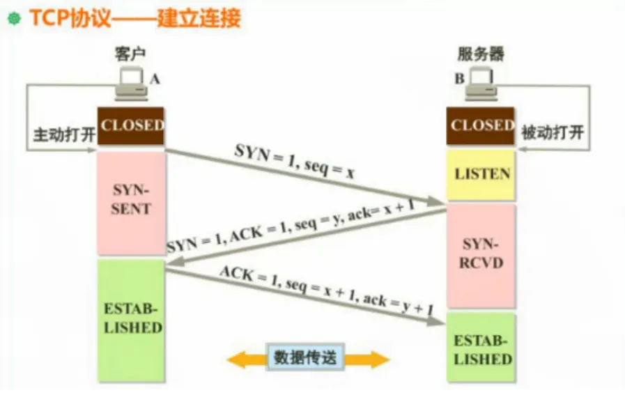

# 网络编程

网络编程的主线基本是：

> 两个进程之间，如何通过网络互相发送数据。

其中，不同层次分别负责：
1. IP + Port 负责找到想要通信的进程。
2. TCP/UDP 负责怎么传数据。
3. HTTP 规定 Web 请求和响应的格式。
4. Web 框架负责把 HTTP 请求映射到代码里的 handler。

## 速览

| 概念 | 作用 | 备注 |
| --- | --- | --- |
| [IP](#ip-地址) | 定位网络中的主机 | IP 解决“发给哪台机器”的问题 |
| [端口](#端口) | 定位主机上的进程 | 端口解决“发给哪个程序”的问题 |
| [Socket](#socket) | 网络通信端点 | Socket 通常由 IP、端口、协议组成 |
| [TCP](#tcp) | 可靠的字节流协议 | 保证顺序、可靠传输，适合 HTTP |
| [UDP](#udp) | 不可靠的数据报协议 | 延迟低，但不保证到达和顺序 |
| [DNS](#dns) | 域名解析 | 把域名转换成 IP 地址 |
| [HTTP](#http) | 应用层协议 | Web 客户端和服务端约定的请求/响应格式 |
| [JSON](#json) | 数据交换格式 | Web API 最常见的结构化数据格式 |
| [REST](#rest-api) | API 设计风格 | 用 URL 表示资源，用 HTTP 方法表示操作 |
| [Cookie/Session/Token](#cookiesessiontoken) | 用户身份识别 | Cookie 是浏览器机制，Session 是服务端状态，Token 是客户端携带的认证凭证 |
| [WebSocket](#websocket) | 长连接双向通信 | 适合聊天、实时推送、协作编辑 |

----

## IP 地址

IP 地址用来标识网络中的一台主机。

略

----

## 端口

端口用来区分不同进程，常见端口：

| 端口 | 常见用途 |
| --- | --- |
| 22 | SSH |
| 53 | DNS |
| 80 | HTTP |
| 443 | HTTPS |
| 3000 | 前端或后端开发服务常用 |
| 5432 | PostgreSQL |
| 6379 | Redis |
| 8080 | Web 服务开发常用 |

----

## Socket

Socket 套接字是对网络链接的抽象，IP:Port 组成一个端点，Socket 基于两个端点抽象出连接。  

可以理解为：

```text
Socket = (ip1:port1 <-> ip2:port2)
```

### 服务端基本流程

服务端网络编程常见流程：

1. `bind`：绑定 IP 和端口。
2. `listen`：开始监听连接。
3. `accept`：接受客户端连接。
4. `read/write`：读写数据。
5. `close`：关闭连接。

Rust 标准库里的 TCP 服务端大概长这样：

```rust
use std::io::{Read, Write};
use std::net::TcpListener;

fn main() -> std::io::Result<()> {
    // 绑定、监听（这里绑定即监听）一个 TCP 端口
    let listener = TcpListener::bind("127.0.0.1:3000")?;
    // incoming 是一个返回一个阻塞迭代器，这意味着它会循环等待新连接，而迭代器里的元素是每个新连接的 TcpStream，准确来说是 Result<TcpStream, Error>
    // TcpStream 就是一个套接字端点，用来表示一个连接,它实现了 Read 和 Write trait，核心能力就是读写数据
    for stream in listener.incoming() {
        let mut stream = stream?;

        let mut buf = [0; 1024];
        let n = stream.read(&mut buf)?;

        println!("收到 {} 字节", n);
        stream.write_all(b"hello")?;
    }

    Ok(())
}
```


## TCP

TCP 是可靠的、面向连接的、基于字节流的传输层协议。

它的特点：

- 需要建立连接。
- 保证数据可靠到达。
- 保证数据顺序。
- 有重传机制。
- 有流量控制和拥塞控制。
- 数据是字节流，没有天然消息边界。

### 连接三次握手

TCP 建立连接要经过三次握手：

1. 客户端发送 `SYN`，表示想建立连接。
2. 服务端回复 `SYN + ACK`，表示同意连接。
3. 客户端回复 `ACK`，连接建立完成。

可以简单理解成：

```text
客户端：我能连你吗（SYN）？
服务端：可以（ACK），我也能连你吗（SYN）？
客户端：可以（ACK），开始通信。
```




### 结束四次挥手

TCP 关闭连接通常需要四次挥手：

1. 一方发送 `FIN`，表示自己没有数据要发了。
2. 另一方回复 `ACK`。
3. 另一方也发送 `FIN`，表示自己也没有数据要发了。
4. 最初一方回复 `ACK`，连接关闭。

为什么不是一次直接关？因为 TCP 是双向通信，一方不发了，不代表另一方也发完了。

## 流量控制和拥塞控制

### 流量控制

流量控制解决的是：**发送方发得太快，接收方来不及处理** 的问题。

TCP 通过**滑动窗口**来实现流量控制。接收方会告诉发送方自己当前还能接收多少数据，这个值叫做**接收窗口**。

可以简单理解为：

- 接收方缓存满了，就告诉发送方“先慢点发”。
- 接收方缓存空出来了，再告诉发送方“可以多发一点”。

这样可以避免发送方把接收方的缓冲区挤爆。

### 拥塞控制

拥塞控制解决的是：**网络太拥挤，大家都发得太多** 的问题。

即使接收方还能处理，如果网络中路由器、链路负载太高，也可能造成大量丢包和重传。TCP 通过拥塞控制来动态调整发送速率。

常见的做法包括：

- **慢启动**：一开始发送得少，之后逐步增加。
- **拥塞避免**：当接近网络承载能力时，放慢增长速度。
- **快速重传**：收到三次重复 ACK，认为某个包丢了，尽快重传。
- **快速恢复**：丢包后不要一下子降得太狠，而是降为原先的一半，跳过慢启动，尽快恢复传输。

TCP 会同时参考**接收窗口**和**拥塞窗口**：

- 接收窗口：接收方能接多少。
- 拥塞窗口：网络当前能承受多少。

最终实际发送量取两者的较小值。

### 字节流

TCP 是字节流，不保留消息边界。

比如发送方连续发送：

```text
hello
world
```

接收方可能一次读到：

```text
helloworld
```

也可能分多次读到：

```text
hel
lowor
ld
```

所以协议层需要自己规定消息边界。HTTP 通过 header、`Content-Length`、chunked 编码等方式解决这个问题。

## UDP

UDP 是不可靠的、无连接的、基于数据报的传输层协议。

特点：

- 不需要建立连接。
- 不保证送达。
- 不保证顺序。
- 不保证不重复。
- 开销小，延迟低。
- 保留消息边界：
```rust
// 发送方发三条消息
let soket = UdpSocket::bind("127.0.0.1:0")?;
let addr = "127.0.0.1:3000";
socket.send_to(b"hello", addr)?;
socket.send_to(b"world", addr)?;
socket.send_to(b"!"， addr)?;

// 接收方必需要三次 recv_from 才能收到三条消息
let mut socket = UdpSocket::bind("127.0.0.1:3000")?;
let mut buf = [0; 1024];
// 接受到的消息顺序不保证，但每条消息都必需是完整的
let (n, addr) = socket.recv_from(&mut buf)?;
let (n, addr) = socket.recv_from(&mut buf)?;
let (n, addr) = socket.recv_from(&mut buf)?;
```

TCP 和 UDP 对比：

| 特性 | TCP | UDP |
| --- | --- | --- |
| 是否连接 | 面向连接 | 无连接 |
| 可靠性 | 可靠 | 不可靠 |
| 顺序 | 保证顺序 | 不保证顺序 |
| 边界 | 字节流，无消息边界 | 数据报，有消息边界 |
| 延迟 | 相对高 | 相对低 |
| 常见场景 | HTTP、数据库连接 | DNS、音视频、游戏 |


## DNS

DNS 用来把域名解析成 IP 地址：

1. 浏览器检查缓存。
2. 操作系统检查缓存。
3. 查询本地 DNS 服务器。
4. 本地 DNS 服务器递归查询又一级 DNS 服务器，或者本机迭代查询根 DNS、顶级域 DNS、权威 DNS。
4. 拿到 IP。
5. 根据 IP 建立 TCP 连接。


## HTTP

HTTP 是应用层协议，采用请求/响应模型。

客户端发送 request，服务端返回 response：

```text
Client  -- HTTP Request  -->  Server
Client  <-- HTTP Response --  Server
```

HTTP 通常运行在 TCP 之上。HTTPS 则是在 HTTP 和 TCP 之间加了一层 TLS 加密。

### HTTP 请求

一个 HTTP 请求大致包括：

```text
GET /users/1 HTTP/1.1
Host: example.com
User-Agent: curl/8.0
Accept: application/json

```

如果是 POST JSON，请求可能是：

```text
POST /users HTTP/1.1
Host: example.com
Content-Type: application/json
Content-Length: 31

{"name":"Alice","age":18}
```

组成部分：

- 请求方法：`GET`、`POST` 等。
- 路径：`/users/1`。
- 协议版本：`HTTP/1.1`。
- 请求头：例如 `Content-Type`。
- 请求体：例如 JSON 数据。

### HTTP 响应

一个 HTTP 响应大致包括：

```text
GET /users/1 HTTP/1.1
Host: example.com
User-Agent: curl/8.0
Accept: application/json

```

如果是 POST JSON，请求可能是：

```text
POST /users HTTP/1.1
Host: example.com
Content-Type: application/json
Content-Length: 25

{"name":"Alice","age":18}
Content-Type: application/json
Content-Length: 23

{"id":1,"name":"Alice"}
```

组成部分：

- 状态码：`200`、`404`、`500` 等。
- 响应头：例如 `Content-Type`。
- 响应体：例如 JSON、HTML、图片等。

### HTTP 方法

常见方法：

| 方法 | 含义 | 示例 |
| --- | --- | --- |
| GET | 获取资源 | `GET /users/1` |
| POST | 创建资源或提交数据 | `POST /users` |
| PUT | 整体更新资源 | `PUT /users/1` |
| PATCH | 部分更新资源 | `PATCH /users/1` |
| DELETE | 删除资源 | `DELETE /users/1` |
| OPTIONS | 查询服务器支持的能力 | CORS 预检请求常用 |

#### 幂等性

幂等表示同一个请求执行多次，结果和执行一次一样。

常见理解：

- `GET` 幂等：查一次和查多次不应该改变资源。
- `PUT` 幂等：把用户改成同一份数据，多次执行结果一样。
- `DELETE` 通常认为幂等：删一次和删多次，最终都是资源不存在。
- `POST` 通常不幂等：重复提交可能创建多个资源。

### HTTP 状态码

状态码表示响应结果。

| 范围 | 含义 |
| --- | --- |
| 1xx | 信息响应 |
| 2xx | 成功 |
| 3xx | 重定向 |
| 4xx | 客户端错误 |
| 5xx | 服务端错误 |

常见状态码：

| 状态码 | 含义 | 常见场景 |
| --- | --- | --- |
| 200 | OK | 请求成功 |
| 201 | Created | 创建资源成功 |
| 204 | No Content | 成功但没有响应体 |
| 301 | Moved Permanently | 永久重定向 |
| 302 | Found | 临时重定向 |
| 400 | Bad Request | 请求参数错误 |
| 401 | Unauthorized | 未登录或 token 无效 |
| 403 | Forbidden | 没有权限 |
| 404 | Not Found | 资源不存在 |
| 409 | Conflict | 资源冲突，例如重复创建 |
| 422 | Unprocessable Entity | 参数格式对，但语义校验失败 |
| 500 | Internal Server Error | 服务端内部错误 |
| 502 | Bad Gateway | 网关收到上游错误 |
| 503 | Service Unavailable | 服务暂时不可用 |


### Header

Header 用来传递请求或响应的元信息。

常见请求头：

| Header | 用途 |
| --- | --- |
| Host | 目标主机 |
| User-Agent | 客户端信息 |
| Accept | 客户端希望接收的数据格式 |
| Content-Type | 请求体格式 |
| Authorization | 认证信息 |
| Cookie | 浏览器携带的 cookie |

常见响应头：

| Header | 用途 |
| --- | --- |
| Content-Type | 响应体格式 |
| Content-Length | 响应体长度 |
| Set-Cookie | 服务端设置 cookie |
| Location | 重定向地址 |
| Cache-Control | 缓存控制 |

常见 `Content-Type`：

```text
application/json
text/html
text/plain
application/x-www-form-urlencoded
multipart/form-data
```


### Body

Body 是请求或响应的主体数据。

常见 body 类型：

- JSON。
- HTML。
- 普通文本。
- 表单。
- 文件。
- 二进制数据。

GET 请求通常没有 body，参数常放在 query string：

```text
GET /users?page=1&page_size=20
```

POST/PUT/PATCH 常用 body 传数据：

```json
{
  "name": "Alice",
  "age": 18
}
```

## REST API

REST 是一种常见的 Web API 设计风格。核心思想是：

> 用 URL 表示资源，用 HTTP 方法表示动作。

例如用户资源：

| 操作 | API |
| --- | --- |
| 查询用户列表 | `GET /users` |
| 查询单个用户 | `GET /users/{id}` |
| 创建用户 | `POST /users` |
| 整体更新用户 | `PUT /users/{id}` |
| 部分更新用户 | `PATCH /users/{id}` |
| 删除用户 | `DELETE /users/{id}` |

不太推荐：

```text
GET /getUser?id=1
POST /deleteUser
```

更推荐：

```text
GET /users/1
DELETE /users/1
```

## JSON

JSON 是 Web API 中最常用的数据交换格式。

请求 JSON：

```json
{
  "username": "alice",
  "password": "secret"
}
```

响应 JSON：

```json
{
  "id": 1,
  "username": "alice",
  "created_at": "2026-05-05T12:00:00Z"
}
```

Rust 中通常用 `serde` 和 `serde_json` 处理 JSON：

```rust
use serde::{Deserialize, Serialize};

#[derive(Debug, Deserialize)]
struct CreateUserRequest {
    username: String,
    password: String,
}

#[derive(Debug, Serialize)]
struct UserResponse {
    id: u64,
    username: String,
}
```

## Cookie、Session、Token

Web 里经常要识别“当前用户是谁”。

### Cookie

Cookie 是浏览器保存的小段数据，会在请求时自动带给同一个站点。

服务端设置 cookie：

```text
Set-Cookie: session_id=abc123; HttpOnly; Secure
```

浏览器之后请求会带上：

```text
Cookie: session_id=abc123
```

### Session

Session 通常是服务端保存的登录状态。浏览器只保存一个 `session_id`，真正的用户信息在服务端。

流程：

1. 用户登录。
2. 服务端生成 `session_id`。
3. 服务端把 `session_id` 放进 cookie。
4. 浏览器后续请求自动带 cookie。
5. 服务端根据 `session_id` 找到用户状态。

### Token

Token 通常由客户端保存，然后放在请求头里：

```text
Authorization: Bearer <token>
```

JWT 是常见 token 格式之一。

对比：

| 方式 | 状态保存在哪里 | 常见特点 |
| --- | --- | --- |
| Cookie + Session | 服务端 | 易控制、可主动失效 |
| Token/JWT | 客户端为主 | 适合前后端分离和多端，但失效控制更复杂 |


## CORS

CORS 是浏览器的跨域资源共享机制。它不是服务端之间的限制，而是浏览器为了安全加的一层限制。

只要协议、域名、端口有一个不同，就算跨域：

```text
http://localhost:3000
http://localhost:8080
```

这两个端口不同，所以跨域。

常见 CORS 响应头：

```text
Access-Control-Allow-Origin: http://localhost:3000
Access-Control-Allow-Methods: GET, POST, PUT, DELETE
Access-Control-Allow-Headers: Content-Type, Authorization
```

### 预检请求

浏览器在某些跨域请求前，会先发一个 `OPTIONS` 请求，确认服务端是否允许。

例如前端想发：

```text
POST /users
Content-Type: application/json
Authorization: Bearer xxx
```

浏览器可能先发：

```text
OPTIONS /users
Access-Control-Request-Method: POST
Access-Control-Request-Headers: content-type, authorization
```

服务端允许后，浏览器才会发送真正的 POST 请求。

## WebSocket

HTTP 是请求/响应模型，客户端发一次请求，服务端回一次响应。

WebSocket 是长连接双向通信。连接建立后，客户端和服务端都可以主动发送消息。

适合场景：

- 聊天室。
- 实时通知。
- 在线协作。
- 实时游戏状态。
- 股票价格推送。

简单对比：

| 特性 | HTTP | WebSocket |
| --- | --- | --- |
| 通信模型 | 请求/响应 | 双向长连接 |
| 服务端主动推送 | 不方便 | 适合 |
| 常见场景 | API、网页、文件 | 聊天、实时通知 |

## HTTPS 和 TLS

> HTTPS = HTTP + TLS

TLS 提供：

- 加密：防止内容被窃听。
- 完整性：防止内容被篡改。
- 身份认证：通过证书确认服务器身份。

为什么需要 HTTPS：

- 登录密码不能明文传输。
- token、cookie 不能被轻易窃听。
- 防止中间人攻击。

## 从 HTTP 到 Web 框架

如果不用框架，写一个完整 HTTP 服务要处理很多事情：

- 监听端口。
- 接受 TCP 连接。
- 解析 HTTP 请求行、header、body。
- 根据 method 和 path 找到处理逻辑。
- 解析 query、path 参数、JSON body。
- 执行业务逻辑。
- 构造 HTTP 响应。
- 处理错误。
- 记录日志。
- 做鉴权、CORS、超时、限流等中间件。

Web 框架就是把这些重复工作封装起来。

以 axum 为例，概念大致对应：

| HTTP/网络概念 | axum 里的概念 |
| --- | --- |
| URL path | `route("/users/:id", ...)` |
| HTTP method | `get(...)`、`post(...)`、`delete(...)` |
| 请求处理函数 | handler |
| JSON 请求体 | `Json<T>` |
| 路径参数 | `Path<T>` |
| 查询参数 | `Query<T>` |
| 共享状态 | `State<T>` |
| 请求处理链路 | middleware / tower layer |
| HTTP 响应 | `IntoResponse` |

所以学 axum 时不要只背 API，要知道它是在帮你处理 HTTP 服务端的常见流程。

## 一个请求的完整过程

以浏览器访问接口为例：

```text
GET https://api.example.com/users/1
```

大致流程：

1. 浏览器解析 URL，知道协议是 HTTPS，域名是 `api.example.com`，路径是 `/users/1`。
2. 浏览器通过 DNS 查询域名对应的 IP。
3. 浏览器和服务端建立 TCP 连接。
4. HTTPS 场景下进行 TLS 握手。
5. 浏览器发送 HTTP 请求。
6. 服务端接收请求，Web 框架解析 method、path、header、body。
7. 路由匹配到对应 handler。
8. handler 执行业务逻辑，可能访问数据库。
9. 服务端构造 HTTP 响应。
10. 浏览器收到响应，根据状态码、header、body 继续处理。
